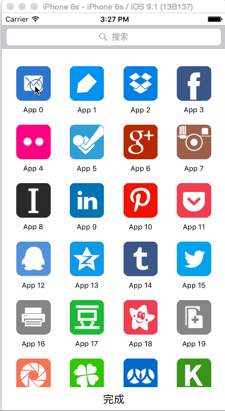

# GridView-Sample

## 项目简介
一个仿iOS SpringBoard风格的可拖拽排序九宫格视图示例项目。实现了类似iPhone主屏幕应用图标的拖拽重排功能，基于UICollectionView封装了完整的宫格视图组件，支持长按拖拽、编辑模式、下拉搜索等功能，是学习iOS自定义视图组件和交互设计的优秀案例。

## 技术栈
- **开发语言**: Objective-C
- **平台**: iOS (iPhone)
- **开发工具**: Xcode 7.0+
- **基础框架**: UIKit
- **核心组件**: UICollectionView、UICollectionViewFlowLayout
- **最低系统**: iOS 9.0+

## 功能特性
- SpringBoard风格九宫格布局
- 长按触发拖拽模式
- 拖拽实时排序
- 平滑的动画过渡效果
- 编辑模式切换
- 图标抖动动画 (编辑状态)
- 下拉搜索功能
- 自定义刷新控件
- 自适应屏幕尺寸
- 流畅的用户交互体验

## 项目结构说明
```
GridView-Sample/
├── GridView-Sample/              # 主项目目录
│   ├── AppDelegate.h/m          # 应用程序委托
│   ├── ViewController.h/m       # 主视图控制器
│   ├── GridView/                # 宫格视图组件
│   │   ├── LWGridScrollView.h/m      # 宫格滚动视图 (核心)
│   │   ├── LWGridViewCell.h/m        # 宫格单元格
│   │   ├── LWGridScrollViewLayout.h/m # 自定义布局
│   │   └── LWGridDefines.h           # 宏定义和常量
│   ├── PullDownSearch/          # 下拉搜索组件
│   │   └── LWPullDownControl.h/m     # 下拉刷新控件
│   ├── Main.storyboard          # 主界面Storyboard
│   ├── LaunchScreen.storyboard  # 启动屏幕
│   ├── Assets.xcassets          # 资源文件
│   └── Info.plist               # 应用配置
├── GridView-Sample.xcodeproj/   # Xcode项目文件
├── GridView-SampleTests/        # 单元测试
├── GridView-SampleUITests/      # UI测试
├── doc/                          # 文档和截图
│   └── gridview-sample.gif      # 效果演示图
└── LICENSE                       # 许可证文件
```

## 核心组件说明

### 1. LWGridScrollView (宫格滚动视图)
继承自UICollectionView，实现了SpringBoard风格的宫格视图。

**主要功能**：
- 管理宫格数据源
- 处理拖拽手势
- 控制编辑状态
- 协调单元格移动
- 支持代理模式

**核心属性**：
```objective-c
@property (nonatomic, assign) id<LWGridScrollViewDelegate> gridViewDelegate;
@property (nonatomic, retain) NSMutableArray *dataArray;  // 数据源
@property (nonatomic, assign) BOOL editing;               // 编辑状态
@property (nonatomic, strong) NSIndexPath *movingItemIndexPath;  // 移动中的项
```

**核心方法**：
```objective-c
- (void)updateEditingState:(BOOL)editing;  // 更新编辑状态
```

### 2. LWGridViewCell (宫格单元格)
表示宫格中的单个单元格，支持图标显示和抖动动画。

**功能**：
- 显示应用图标
- 编辑模式下的抖动效果
- 删除按钮显示
- 状态切换动画

### 3. LWGridScrollViewLayout (自定义布局)
继承自UICollectionViewFlowLayout，定制宫格布局算法。

**功能**：
- 计算单元格尺寸
- 设置间距和边距
- 支持拖拽时的布局更新
- 优化布局性能

### 4. LWPullDownControl (下拉搜索控件)
自定义的下拉刷新控件，用于搜索功能。

**功能**：
- 下拉手势检测
- 刷新动画
- 自定义UI样式
- 回调block支持

**核心属性**：
```objective-c
@property (nonatomic, strong) UILabel *titleLabel;      // 标题标签
@property (nonatomic, strong) UIImageView *imgLogo;     // Logo图标
```

**初始化方法**：
```objective-c
- (instancetype)initWithFrame:(CGRect)frame withBlock:(void (^)())block;
```

## 主要功能实现

### 1. 长按拖拽
```objective-c
// 添加长按手势识别器
UILongPressGestureRecognizer *longPress =
    [[UILongPressGestureRecognizer alloc] initWithTarget:self
                                                  action:@selector(handleLongPress:)];
[gridView addGestureRecognizer:longPress];
```

### 2. 拖拽排序
基于UICollectionView的交互式移动API：
```objective-c
// 开始移动
[collectionView beginInteractiveMovementForItemAtIndexPath:indexPath];

// 更新位置
[collectionView updateInteractiveMovementTargetPosition:location];

// 结束移动
[collectionView endInteractiveMovement];
```

### 3. 编辑模式
```objective-c
- (void)updateEditingState:(BOOL)editing {
    self.editing = editing;
    // 更新所有单元格的编辑状态
    // 显示/隐藏删除按钮
    // 启动/停止抖动动画
}
```

### 4. 抖动动画
```objective-c
// CAKeyframeAnimation实现图标抖动
CAKeyframeAnimation *animation = [CAKeyframeAnimation animationWithKeyPath:@"transform.rotation"];
animation.values = @[@(-0.03), @(0.03), @(-0.03)];
animation.duration = 0.15;
animation.repeatCount = HUGE_VALF;
[cell.layer addAnimation:animation forKey:@"shake"];
```

## 界面组成

### 主界面 (ViewController)
```objective-c
// 1. 搜索栏
@property (nonatomic, strong) UISearchBar *searchBar;

// 2. 宫格视图
@property (nonatomic, strong) LWGridScrollView *gridView;

// 3. 完成按钮
@property (nonatomic, strong) UIButton *completeBtn;
```

### 布局层次
```
UIViewController
├── UISearchBar (顶部搜索栏)
├── LWGridScrollView (中间宫格区域)
│   └── LWGridViewCell (多个单元格)
└── UIButton (底部完成按钮)
```

## 依赖要求
- **Xcode**: 7.0 及以上版本
- **iOS**: 9.0 及以上系统
- **开发语言**: Objective-C
- **设备**: iPhone (支持所有尺寸)

## 安装和运行方法

### 1. 克隆项目
```bash
git clone <repository-url>
cd GridView-Sample
```

### 2. 打开项目
```bash
open GridView-Sample.xcodeproj
```

### 3. 选择设备
在Xcode中选择目标设备或模拟器：
- iPhone 6/7/8
- iPhone 6 Plus/7 Plus/8 Plus
- iPhone X/XS/XR
- 或任意iOS模拟器

### 4. 编译运行
点击运行按钮 (⌘+R) 或菜单 Product → Run

## 使用说明

### 基本操作
1. **浏览**：滑动查看所有图标
2. **搜索**：点击顶部搜索栏输入关键字
3. **编辑**：长按任意图标进入编辑模式
4. **拖拽**：在编辑模式下拖动图标调整位置
5. **完成**：点击底部"完成"按钮退出编辑

### 编辑模式特点
- 所有图标开始抖动
- 显示删除按钮（如果支持）
- 可拖拽重排图标位置
- 实时保存排序结果

## 效果截图



## 集成到项目

### 1. 复制组件文件
将以下文件复制到您的项目：
```
GridView/
├── LWGridScrollView.h/m
├── LWGridViewCell.h/m
├── LWGridScrollViewLayout.h/m
└── LWGridDefines.h
```

### 2. 导入头文件
```objective-c
#import "LWGridScrollView.h"
#import "LWGridScrollViewLayout.h"
```

### 3. 创建宫格视图
```objective-c
LWGridScrollViewLayout *layout = [[LWGridScrollViewLayout alloc] init];
LWGridScrollView *gridView = [[LWGridScrollView alloc]
    initWithFrame:CGRectMake(0, 0, width, height)
    collectionViewLayout:layout];
gridView.dataArray = yourDataArray;
[self.view addSubview:gridView];
```

### 4. 实现代理方法
```objective-c
// 根据需要实现LWGridScrollViewDelegate代理方法
```

## 自定义配置

### 修改宫格样式
在LWGridDefines.h中定义常量：
```objective-c
// 列数
#define kGridColumnCount 4

// 单元格尺寸
#define kGridCellWidth 70
#define kGridCellHeight 90

// 间距
#define kGridCellSpacing 10
```

### 自定义单元格
继承LWGridViewCell并重写相关方法：
```objective-c
@interface CustomGridCell : LWGridViewCell
// 自定义属性和方法
@end
```

## 学习要点
- UICollectionView高级应用
- 自定义UICollectionViewLayout
- 手势识别器使用 (UILongPressGestureRecognizer)
- 交互式移动API
- CAAnimation动画编程
- UIRefreshControl自定义
- iOS触摸事件处理
- MVC设计模式
- 代理模式应用
- 响应式布局

## 技术亮点
1. **流畅的拖拽体验**：使用UICollectionView的原生交互式移动API
2. **优雅的动画效果**：CAKeyframeAnimation实现图标抖动
3. **组件化设计**：清晰的模块划分，易于复用
4. **自适应布局**：支持不同屏幕尺寸
5. **性能优化**：复用单元格，减少内存占用

## 应用场景
- 应用管理界面
- 文件夹管理
- 图片墙/相册
- 可排序的菜单
- 自定义SpringBoard
- 功能入口页面

## 扩展建议
- 添加文件夹功能（图标叠加）
- 支持多页切换（分页）
- 实现图标删除功能
- 添加批量编辑模式
- 支持不同尺寸单元格
- 持久化保存排序结果
- 添加搜索过滤功能
- 支持横屏模式

## 注意事项
1. 项目使用Objective-C编写，适合iOS 9.0+系统
2. 需要理解UICollectionView的工作原理
3. 拖拽功能需要iOS 9.0及以上系统支持
4. 建议在真机上测试获得最佳体验

## 适用场景
- iOS自定义视图组件学习
- UICollectionView进阶开发
- 交互设计实践
- 应用管理功能实现参考

## 作者
luowei (wodedata)

## 许可证
请查看LICENSE文件了解详细信息

## 相关资源
- UICollectionView官方文档
- iOS动画编程指南
- iOS手势识别编程指南
